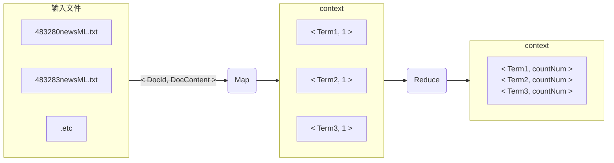
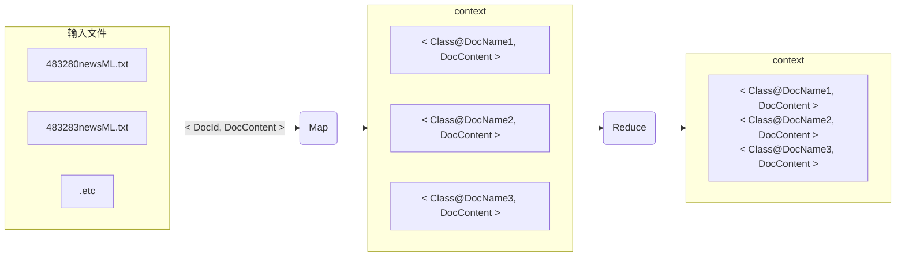
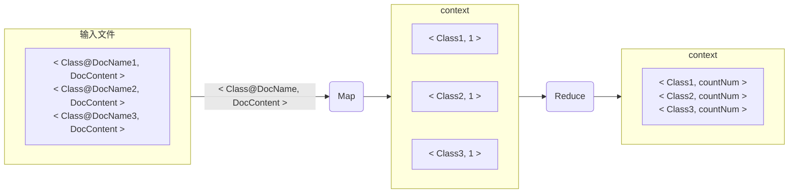
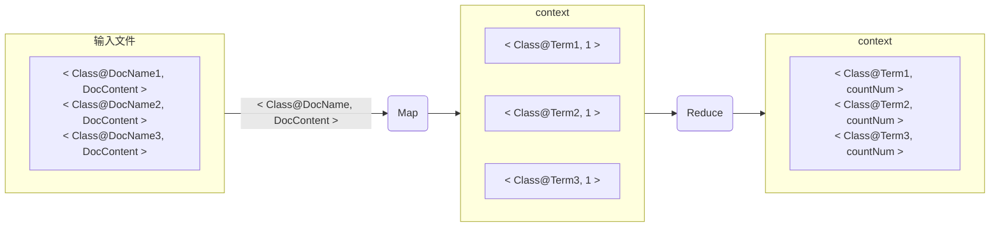
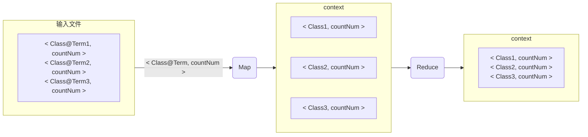
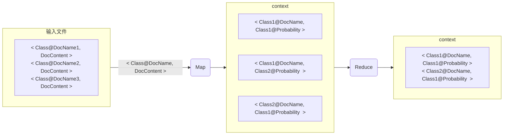

# WordCount

# SequenceFile

# p(class)统计各类别文档数目

# p(term|class)统计各类别各单词出现次数

# p(term|class)统计各类别单词总数目

# 对测试集使用贝叶斯公式

$$
\begin{aligned} 
p(class|doc)&=\frac{p(doc|class)p(class)}{p(doc)}∝p(doc|class)p(class) \\
&=p(class)\prod_{t_k∈T=\{t_1,t_2,……,t_n\}}{p(t_k|class)} \\
\end{aligned}
$$

***floating point underflow*（浮点下溢）：取 *log***
$$
\begin{aligned} 
log(p(class|doc))&=log(p(class))+\sum_{t_k∈T=\{t_1,t_2,……,t_n\}}{log(p(t_k|class))} \\
&
\end{aligned}
$$
**先验概率 *Prior*：**
$$
p(class)=\frac{N_c}{N} \\
N_c:number\ of\ docs\ in\ class\ c \\
N:total\ number\ of\ docs
$$
**条件概率 *Conditional Probabilities*：**
$$
\begin{aligned} 
p(t|class)&=\frac{t在类型为class的文档中出现的次数}{在类型为class的文档中出现的term的总数} \\
&=\frac{T_{ct}}{\sum_{t'\in V}T_{ct'}}
\end{aligned}
$$
**存在 term 未出现时，其条件概率为 0，*log0* 无法计算：加一平滑：**
$$
\begin{aligned} 
p(t|class)&=\frac{T_{ct}+1}{\sum_{t'\in V}{(T_{ct'}+1)}} \\
&=\frac{T_{ct}+1}{(\sum_{t'\in V}{T_{ct'}})+B} \\
&B:the\ number\ of\ different\ words 
\end{aligned}
$$
**取最优：**
$$
c_{map}=arg\ max\ [log\frac{N_c}{N}+\sum_{1\leq k\leq n}{\frac{T_{ct_k}+1}{(\sum_{t'\in V}{T_{ct'}})+B}}]
$$

